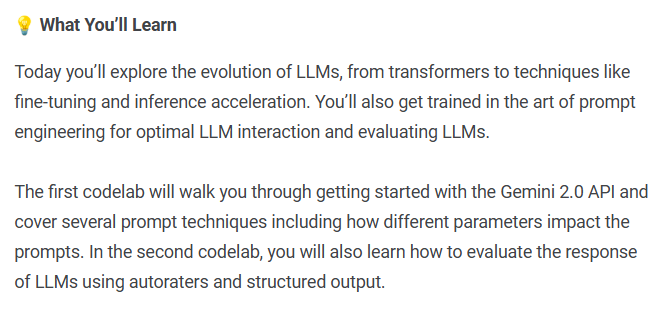

## TODO :
1. Complete the Intro Unit – “Foundational Large Language Models & Text Generation”:
    - [ ] <a href="https://notifications.googleapis.com/email/redirect?t=AFG8qyVt7VdC5kKCzPfd8yKRfYlg4oEif55NW9ax_eZRSDTz2tp_9C09qI28rg_kqOvMVXh2irGkDUOjMTUAeppbzLC-wHmUhtA025HiWWaqgK35blncGC_SSZy3QR-G-8Rodv36M1r6vmOu3SbeId2JMqA91z0zXTPF_D40UAPA5sTPuY8yuwpBcWyG86TGBE_7WNbn4-ZhJH9sQUVi1CrHFf0RzOeWfVwFyqnvwVii856V3s8Z7pW7RkywxIHAza-98o2KPw&r=eJzLKCkpKLbS1y8vL9erzC8tKU1K1UvOz9UvTyxJzrAvs_VLNPY3CchOKtANVcvJLC6xDfApdEsM8Uw3ya0sja_09iooc7MIdzXySkt0N812Ly3Ld1XLzEtJrbA1BADlDyAU&s=ALHZ2r5TnLt60sHBoq5UUaX2ljIg">summary link</a>
    - [ ] read the <a href="./whitepaper_Foundational Large Language models & text generation_v2.pdf">whitepaper</a>
